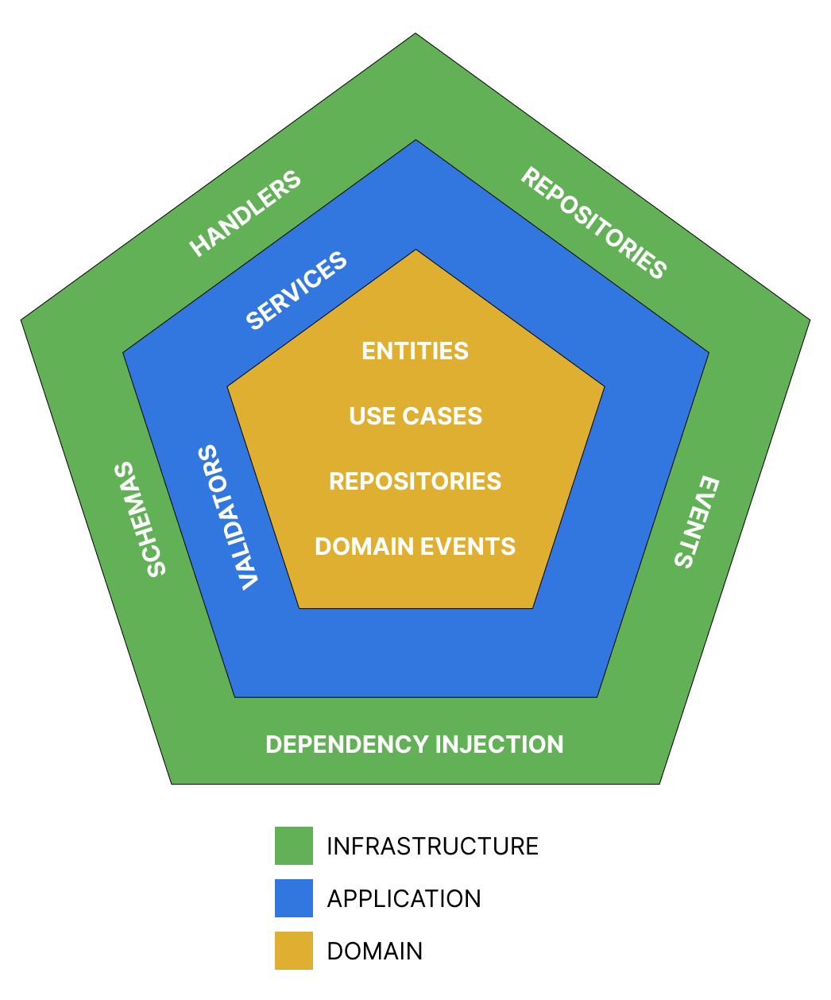

# Hexagonal architecture example with Python

Example of a microservice designed following the definition of hexagonal architecture.
Depending on the size of our system, there may be more sub-layers within the application, domain or infrastructure.
So it is requested to take it as a base.

**Let's explain architecture**

* Principal layers:
  * Domain
  * Application
  * Infrastructure
  * Test

> Domain:
> * In this layer we place all the business logic, such as:
>   - Entities with business rules.
>   - Interfaces or ports that define the behavior of use cases, repositories or events that are then implemented by the application and infrastructure layers.
>   - It is important to highlight that in this layer we should not use 3rd party technologies
>
> Application:
> * In this layer we put all the functionality that is related to our application, for example:
>   - Services which implement the use cases defined in the domain layer
>   - Data validations that allow verifying if the input data is correct, such as character lengths.
> 
> Infrastructure:
> * In this layer we place the input and output adapters, which implement the interfaces defined for the repositories or business events. For example:
>   - Repository that stores the data in a database.
>   - Events that communicate with some queuing engine.
>   - Handlers that serve as the entry point and that call the application services.
>   - In this layer we can implement any 3rd party library.
> 
> Test:
> * In this directory we will place all the tests of our application.



* Structure

```bash
├── app
│   ├── application 
│   │   ├── validators # Validation logic for input data
│   │   └── services # Implement the use cases
│   ├── domain
│   │   ├── entities # Entities with business logic
│   │   ├── events # Interface that defines how an event behaves
│   │   ├── repositories # Interface that defines how a data repository behaves
│   │   ├── use cases # Interface that defines the use cases of the application
│   │   └── exceptions # Domain exceptions
│   ├── infrastructure
│   │   ├── events # Implements the domain event interface
│   │   ├── handlers # Application entry point
│   │   ├── repositories # Implements the domain repository interface
│   │   ├── schemas # Data structures used as input and output
│   │   └── container # Dependency injector
└───└── test
```

**Technologies**

- python
- fastapi
- dependency-injector
- pytest
- pydantic
- docker
- make

**Commands**
```bash
$ make build #Create docker images
```

```bash
$ make up #Run the docker container
```

```bash
$ make down #Stop the docker container
```

**References**

- https://alistair.cockburn.us/hexagonal-architecture/
- http://wiki.c2.com/?HexagonalArchitecture